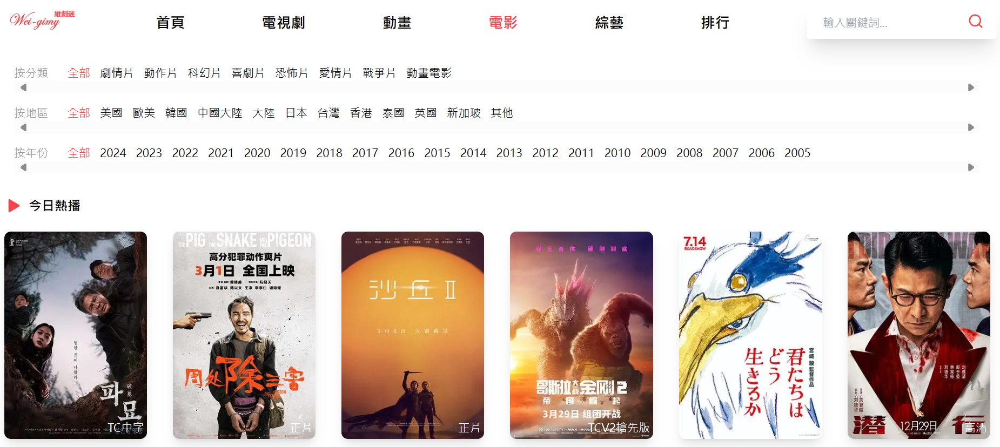

# Gimy Clone Website

## Introduction
This is a website to imitate a [real live-streaming media website](https://gimy.ai).

The user can find different film in here, and it will insert the ad in website and film.

Furthermore, It made by Next.js and using Tailwind css and deploy by docker.

Fetch the data by [backend project](https://github.com/weiawesome/gimy_clone_api) to get the media and data.
## Main Function
### For User
1. Browse the film classify by film type
2. Filter and sort the film by category, location and release year
3. Obtain the rank of the film by film type or category
4. Search films by title, content or celebrity's name
5. Watch the film by different routes and view by http-live-streaming

### For Resource Provider
1. Create a new film with specific information
2. Upload film's episode or image
3. Let the film into search engine

### For Sponsor ( Advertisement )
1. Give different type of advertisement
   1. The ad is a film insert into the film's play
   2. The ad is a GIF manifest in the website
   3. The ad is a static image file in the website
2. Check the advertisement period

## User Interface ( RWD )
### Home Page

### Different Type Page 



### Filter and Sort Page

### Ranking Page

### Film Information Page


### Search Page


### Create Film Page

### Upload Film's resource Page

### Deliver the advertisement Page


## System Architecture
### MVC ( Model-View-Controller )
```
├── src
│   ├── app
│   │   ├── app.tsx
│   │   ├── layout.tsx
│
│   ├── pages
│   │   ├── upload
│   │   │   ├── ...tsx
│   │   ├── resource
│   │   │   ├── ...tsx
│
│   ├── components
│   │   ├── ...tsx
│
│   ├── model
│   │   ├── ...ts
│
│   ├── service
│   │   ├── ...ts
│
│   ├── svgs
```
### [Model](./src/model)
It defined the model of different request and response. 

### [View](./src/pages)
It builds the all the view in the website.

### [Controller](./src/service)
It made all the request in here.

```
Note :
    Except the MVC Architecture, it also make the components directory to correspond react design.
```